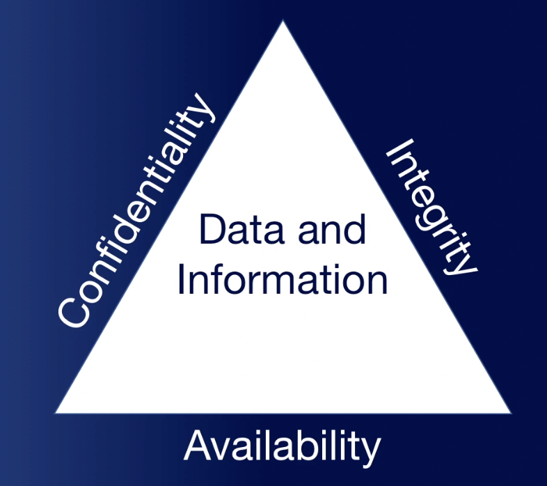

# Overview

* This section of the course focuses on the foundational knowledge
required for understanding cyber security before diving into technical aspects.
* Cyber security involves a constant struggle between security and convenience,
where trade-offs must be made.
* Balancing security and convenience is a challenge both at home and
within organizations.
* The desire for convenience often compromises security,
leading to cyber attacks and data breaches.
* Major companies spend significant amounts,
around 1.3 million dollars per data breach, due to this trade-off.
* The section will cover foundational concepts such as the CIA triad
and triple As of security.
* Two key terms are defined:
information security and information systems security.
* Information security pertains to protecting data from unauthorized access,
modification, disruption, disclosure, corruption, and destruction.
* Information systems security focuses on safeguarding the devices 
(e.g., computers, servers, networks, smartphones) that hold
and process critical data.
* Section one provides an overview of various topics,
with more in-depth coverage in subsequent sections to prepare 
students for certification exams.

## CIA Triade

* The CIA triad is a foundational concept in cybersecurity, consisting of
three components: confidentiality, integrity, and availability.
    * Confidentiality ensures that information is not disclosed to unauthorized
individuals, both in the physical and digital world.
Encryption plays a key role in maintaining confidentiality.
    * Integrity focuses on preventing unauthorized modification or
alteration of information. Maintaining the accuracy and trustworthiness of
data is crucial for preserving integrity.
    * Availability ensures that information is accessible, stored,
and protected at all times. It is important for systems to be available
and functional when needed by users.
* The CIA triad works together to provide secure and usable systems.
Losing any of the components can create vulnerabilities that attackers may
exploit.
* Encryption, authentication, and hashes are examples of security measures
that contribute to achieving confidentiality, integrity, and availability.
* Understanding and applying the CIA triad is essential for building robust
security practices and protecting data and information effectively.

## AAA of Security

* The three A's of security are authentication, authorization, and accounting.
* Authentication establishes a person's identity through proof and confirmation
by the system.
    * Auth methods includei passwords, biometrics, tokens,
    actions, and location factors.
* Authorization grants users access to specific data or areas
based on their authorized privileges.
* Accounting involves tracking data, computer usage, and network resources
through log files to ensure good accounting practices and enable investigation
in case of breaches or insider threats.
* Non-repudiation ensures that users cannot deny their actions by
providing evidence, such as digital signatures, that proves their involvement.

## Security Threats

* Security threats pose risks to systems, computers, and servers.
* Four main categories of security threats are:
    1. Malware
    2. Unauthorized access
    3. System failure
    4. Social engineering
* Malware includes various malicious software types like viruses, worms,
Trojan horses, spyware, rootkits, adware, and ransomware.
* Unauthorized access occurs when unauthorized individuals gain access to
computer resources or data without the owner's consent.
* System failure refers to computer crashes or application failures,
often symbolized by the "blue screen of death" (BSOD) in older Windows systems.
* Social engineering involves manipulating users into divulging confidential
information or performing actions harmful to themselves or their company,
often through methods like phishing or physical deception.

## Mitigating Threats

* Threat mitigation involves three basic categories of controls:
    1. Physical
    2. Technical
    3. Administrative
* Physical controls are tangible measures implemented in the
real-world environment, such as alarms, surveillance cameras, locks, fences,
identification cards, and security guards.
* Technical controls encompass technologies and systems like smart cards,
access control lists, intrusion detection systems,
encryption, and network authentication.
* Administrative controls include policies, procedures, security awareness
training, contingency plans, and disaster recovery plans.
* Administrative controls can be further classified into procedural controls
(voluntary actions taken by the organization) and legal/regulatory controls
(mandatory requirements imposed by laws and regulations).
* User training is a cost-effective administrative control that plays a
crucial role in overall security, as users' actions can bypass technical controls.
* The combination of physical, technical, and administrative controls is
essential for comprehensive security.
* The terms "administrative controls" and "managerial controls" refer to the
same concept of policies and written organizational constraints.

## Section
* one bullet point
* two bullet

1. hello
2. hello

